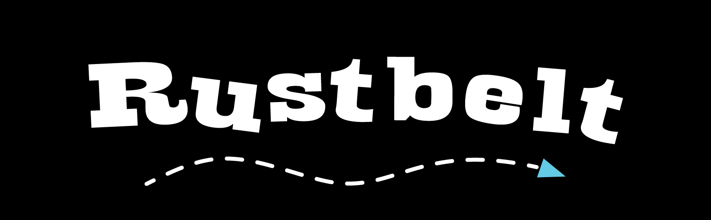
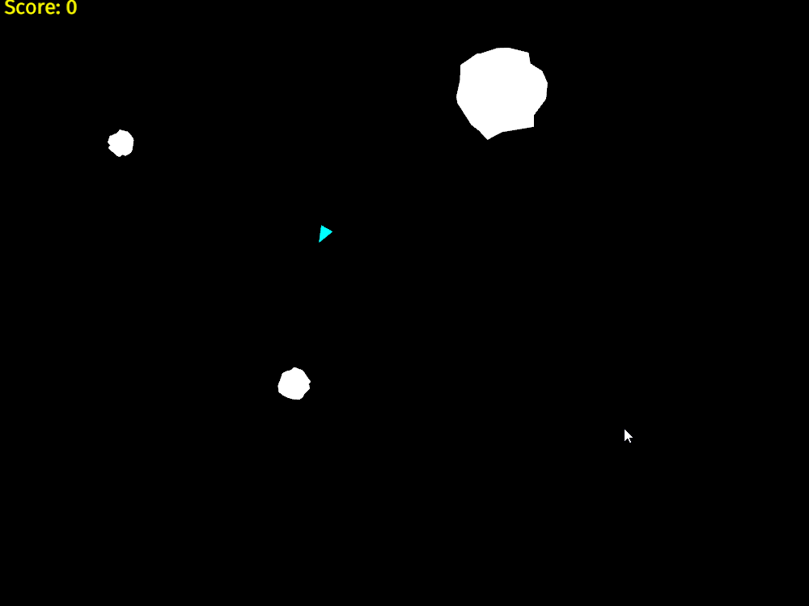

| Build Status |                                                                                |
|--------------|--------------------------------------------------------------------------------|
| Travis       | [![Travis Build Status][travis-build-status-svg]][travis-build-status]         |
| AppVeyor     | [![AppVeyor Build Status][appveyor-build-status-svg]][appveyor-build-status]   |

[![GitHub Releases][github-release-svg]][github-release]

`rust-belt` is a 2D video game featuring an original soundtrack :musical_score: inspired by the 
classic [Asteroids](https://en.wikipedia.org/wiki/Asteroids_(video_game)) arcade game. It is 
implemented  using the [Rust](https://www.rust-lang.org/) game engine, 
[Piston](http://www.piston.rs/).



# Requirements

## Prerequisites

1. The latest stable release of Rust.
    1. Install [`rustup`](https://www.rust-lang.org/install.html).

2. `rust-belt` uses [`piston-music`](https://github.com/PistonDevelopers/music) to play music. 
    `piston-music` depends on two third-party non-Rust libraries, [SDL2](https://www.libsdl.org/) 
    and [SDL2_mixer](https://www.libsdl.org/projects/SDL_mixer/). Install instructions are provided
    below.

## Windows

Select to proceed with either the MSVC or GNU toolchain.

### MSVC (Recommended)

1. Ensure you are using the latest stable 64-bit MVSC toolchain with `rustup show` 
   (`stable-x86_64-pc-windows-msvc`).
2. Ensure you have installed the [Build Tools for Visual Studio](https://aka.ms/buildtools)
   as instructed by `rustup` during install.
3. [Download](https://www.libsdl.org/download-2.0.php) the latest SDL2 MSVC development library 
   (`SDL2-devel-2.0.x-VC.zip`).
4. Unpack and copy all `.lib` files from `SDL2-devel-2.0.x-VC\SDL2-2.0.x\lib\x64\` into a folder. 
   If the `LIB` system environment variable does not exist, create it. Add that folder path to 
   `LIB`.
5. Copy `SDL2.dll` into the `rust-belt` project folder, next to `Cargo.toml`.
6. [Download](https://www.libsdl.org/projects/SDL_mixer/) the latest SDL2_mixer MSVC development
   library (`SDL2_mixer-devel-2.0.x-VC.zip`).
7. Unpack and copy all `.lib` files from `SDL2_mixer-devel-2.0.x-VC\SDL2_mixer-2.0.x\lib\x64` into 
   the same folder added in step 4 that was added to the `LIB` system environment variable.
8. Copy `SDL2_mixer.dll` and `smpeg2.dll` into the `rust-belt` project folder, next to 
   `Cargo.toml`.

### GNU/MinGW-w64

1. Ensure you using the latest stable 64-bit GNU ABI toolchain with `rustup show` 
   (`stable-x86_64-pc-windows-gnu`).
2. Install [MSYS2](https://msys2.github.io/).
3. In an MSYS2 terminal: `pacman --sync mingw-w64-x86_64-gcc`
4. Add `C:\msys64\mingw64\bin` to system `PATH`.
5. [Download](https://www.libsdl.org/download-2.0.php) the latest SDL2 MinGW development library 
   (`SDL2-devel-2.0.x-mingw.tar.gz`).
6. Unpack and copy all `.lib` files from `SDL2-devel-2.0.x-mingw\SDL2-2.0.x\x86_64-w64-mingw32\lib`
   into a folder. If the `LIBRARY_PATH` system environment variable does not exist, create it. Add 
   that folder to `LIBRARY_PATH`.
7. Copy `SDL2.dll` into the `rust-belt` project folder, next to `Cargo.toml`.
8. [Download](https://www.libsdl.org/projects/SDL_mixer/) the latest SDL2_mixer MinGW development 
   library (`SDL2_mixer-devel-2.0.x-mingw.tar.gz`).
9. Unpack and copy all `.lib` files from 
   `SDL2_mixer-devel-2.0.x-mingw\SDL2_mixer-2.0.x\x86_64-w64-mingw32\lib\` into the same folder 
   added in step 6 that was added to the `LIB` system environment variable.
10. Copy `SDL2_mixer.dll` and `smpeg2.dll` into the `rust-belt` project folder, next to 
    `Cargo.toml`.

## Mac OSX

1. Install [Homebrew](http://brew.sh/) (by default this will install `gcc` via Xcode development 
   tools).
2. `brew install sdl2`
3. `brew install sdl2_mixer --with-flac --with-fluid-synth --with-libmikmod --with-mpg123`

## Ubuntu

1. `sudo apt install libsdl2-dev libsdl2-mixer-dev`

## Build and Run

To build:

```bash
$ cargo build
```

To run:

```bash
$ cargo run --release
```

## How to Play

Keyboard         | Menu        | Game
---------------- | ----------- | -------------------
<kbd>W</kbd>     | Up          | Accelerate Forward 
<kbd>S</kbd>     | Down        | Accelerate Backward
<kbd>A</kbd>     |             | Rotate left
<kbd>D</kbd>     |             | Rotate right
<kbd>Space</kbd> | Select      | Shoot
<kbd>X</kbd>     |             | Return to Menu
<kbd>Esc</kbd>   | Exit        | Exit

# Maintainers
* [@johnthagen](https://github.com/johnthagen)
* [@mcdenhoed](https://github.com/mcdenhoed)

Special thanks to [@aochagavia](https://github.com/aochagavia) for 
[rocket](https://github.com/aochagavia/rocket), which provided many examples to pull from.

## Music

Music composed by [@johnthagen](https://github.com/johnthagen).  All rights reserved.

Sound from [freesound.org](https://www.freesound.org/).

<!-- Badges -->
[travis-build-status]: https://travis-ci.org/johnthagen/rust-belt
[travis-build-status-svg]: https://travis-ci.org/johnthagen/rust-belt.svg?branch=master

[appveyor-build-status]: https://ci.appveyor.com/project/johnthagen/rust-belt
[appveyor-build-status-svg]: 
    https://ci.appveyor.com/api/projects/status/nbkgf5i3p4998a2j/branch/master?svg=true

[github-release]: https://github.com/johnthagen/rust-belt/releases
[github-release-svg]: https://img.shields.io/github/release/johnthagen/rust-belt.svg
